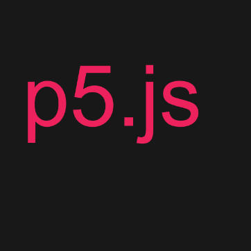
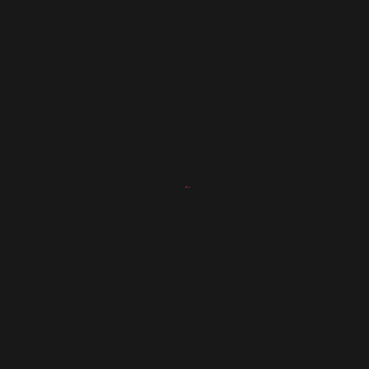
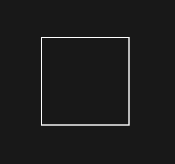

# p5-teach.js
This project would involve developing tools for teaching through p5.js, adding functions to animate shapes and exporting the animation in different formats (mp4 or webm). Main focus is to introduce a simple, easy to use library to animate and make scenes. This will also take advantage of p5.js core library - p5.sound.js for sound effects.

- https://two-ticks.github.io/p5-teach.js/
- https://two-ticks.github.io/p5-teach.js/in-browser-animation/
- https://two-ticks.github.io/p5-teach.js/ft-example/
- https://two-ticks.github.io/p5-teach.js/effects/

### API 

|Function|Description|
|:---:|:---:|
| write(object)  |   Writes the text with a blurry effect at each new character.   |
| typeWriter(object)  |    Write the text with the typing effect. |
| fadeIn(object, duration)  |    Make a fade in effect.|
|  fadeOut(object, duration) |     Make a fade out effect. |
|  blink(object, duration) |     Make a blinking effect.|
| wipeIn(object, duration)  |     Make a wipe in effect.|
| wipeOut(object, duration)  |    Make a wipe out effect. |
|  zoomIn(object, duration) |    Make a zoom in effect. |
| zoomOut(object, duration)  |    Make a zoom out effect. |
| moveAlongPath(object, path)  |Moves object along the defined path   |
| Transform(object1, object2)  | Transforms one shape into another by interpolating vertices from one to another. Similar to this example  |
| Shift(x,y)  | Shifts shape and object by x and y  |
|wait(duration)   | Waits for the duration specified before playing the next animation. It is helpful in timing the animation.  |
| Create(object)  |    Creates animation of object building up from scratch.|
|   |   |